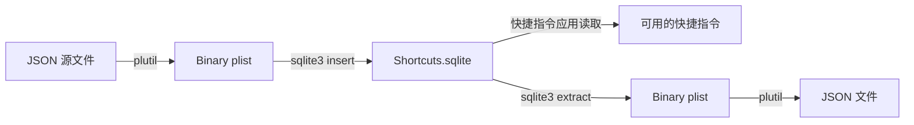
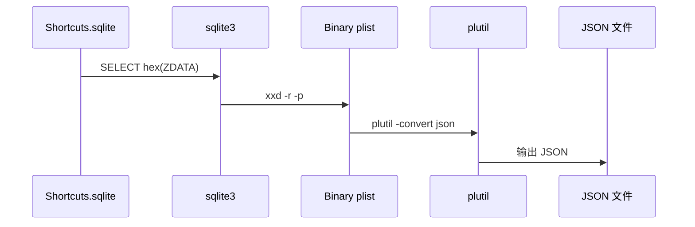
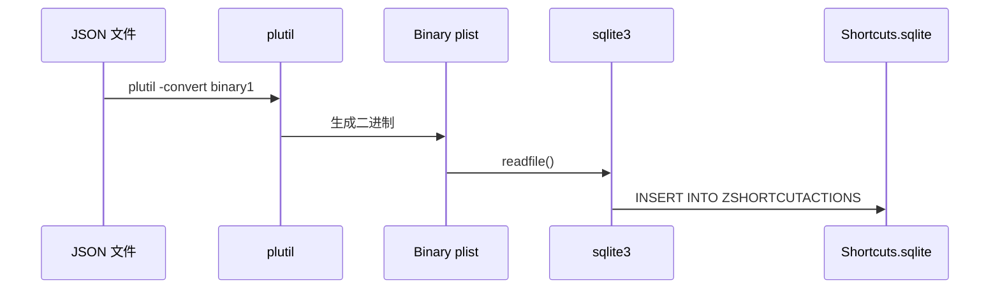

# AI 生成快捷指令工具

用 AI 编程方式创建 macOS/iOS 快捷指令，绕过图形界面。

## 原理

### 快捷指令存储位置

```
~/Library/Shortcuts/Shortcuts.sqlite
```

快捷指令存储在 **SQLite 数据库**中，不是独立文件。

### 数据库结构

```
ZSHORTCUT 表         - 快捷指令元数据（名称、创建时间等）
  ├─ Z_PK           - 主键
  ├─ ZNAME          - 快捷指令名称
  └─ ZACTIONS       - 关联的动作ID

ZSHORTCUTACTIONS 表  - 快捷指令的具体操作
  ├─ Z_PK           - 主键
  ├─ ZSHORTCUT      - 外键关联到 ZSHORTCUT
  └─ ZDATA          - Binary plist 数据
```

### 转换流程



### 详细转换步骤

**导出（数据库 → JSON）：**



**导入（JSON → 数据库）：**



## 使用方法

### 1. 导出现有快捷指令

```bash
./export_all_shortcuts.sh
```

所有快捷指令导出到 `exported_shortcuts/` 目录。

### 2. 用 AI 生成新快捷指令

将现有的 JSON 文件给 AI，描述需求：

```
参考 exported_shortcuts/GPT2md.json，
帮我创建一个快捷指令：从剪贴板获取 YouTube 链接，
在 subtitle.to 打开字幕页面
```

### 3. 导入快捷指令

```bash
./import.sh <json文件> <快捷指令名称>

# 例如
./import.sh yt-subtitle-simple.json "YouTube字幕"
```

### 4. 同步到 iPhone

Mac 上导入后，启用 iCloud 同步即可自动同步到 iPhone。

## 核心文件

```
import.sh                    # 导入脚本
export_all_shortcuts.sh      # 导出脚本（未提交）
yt-subtitle-simple.json      # 示例：YouTube字幕快捷指令
exported_shortcuts/          # 导出的快捷指令（未提交）
```

## 快捷指令 JSON 结构

```json
[
  {
    "WFWorkflowActionIdentifier": "is.workflow.actions.getclipboard",
    "WFWorkflowActionParameters": {
      "UUID": "唯一ID"
    }
  },
  {
    "WFWorkflowActionIdentifier": "is.workflow.actions.conditional",
    "WFWorkflowActionParameters": {
      "WFCondition": 99,
      "WFConditionalActionString": "匹配文本"
    }
  }
]
```

### 常用动作标识符

| 动作 | 标识符 |
|------|--------|
| 获取剪贴板 | `is.workflow.actions.getclipboard` |
| 从 Safari 获取 URL | `is.workflow.actions.safari.geturl` |
| 替换文本 | `is.workflow.actions.text.replace` |
| 打开 URL | `is.workflow.actions.openurl` |
| 条件判断 | `is.workflow.actions.conditional` |
| 显示提醒 | `is.workflow.actions.alert` |

## 技术细节

### 为什么需要这个工具？

- ❌ Apple 不提供编程 API
- ❌ 只能用图形界面拖拽
- ✅ 用 JSON + AI 批量生成
- ✅ 版本控制和分享

### 文件格式

- **存储格式**：Binary Property List (bplist)
- **编辑格式**：JSON
- **转换工具**：`plutil`（macOS 内置）

## 示例快捷指令

### yt-subtitle-simple.json

从剪贴板获取 YouTube 链接，自动在 subtitle.to 打开字幕页面。

**使用：**
1. 复制 YouTube 链接
2. 运行快捷指令
3. 自动打开字幕页面

**工作流程：**
```
获取剪贴板 → 判断是否包含 youtube.com → 替换 https:// 为 https://subtitle.to/ → 打开 URL
```

## 限制

- 需要 macOS（用于导入导出）
- 导入后需重启"快捷指令"应用
- 直接修改数据库可能触发 SQLite trigger 警告（可忽略）

